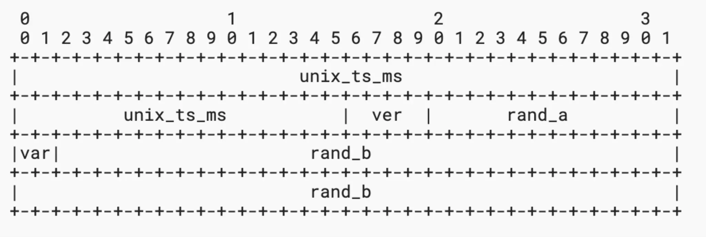
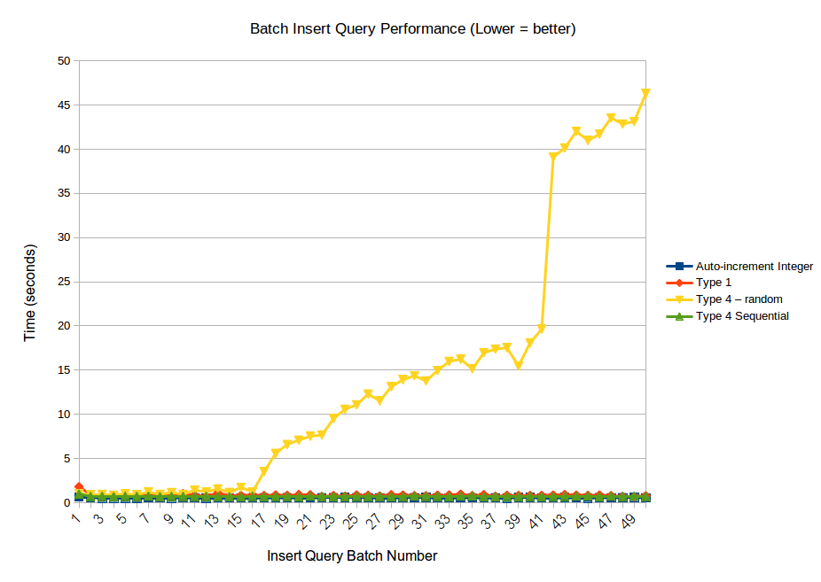

MSA 환경에서 글로벌 고유 식별자(global ID)가 필요한 이유와 global ID로 사용할 수 있는 방식 중 UUID version 4와 version 7을 비교해보자

## 분산 환경에서 고유 식별자가 왜 필요할까?
분산환경에서는 여러 서버, 데이터베이스, 서비스가 독립적으로 운영되는데 이러한 환경에서 식별자를 관리할때 ID 충돌 방지하고, 각 서비스에서 동일한 데이터를 정확히 참조하기 위해 고유한 식별자가 필요하다.

### ID 충돌이 문제가 되는 이유
예를 들어, 유저 A가 있을 때
- 인증 시스템 -> (auth_user_id=1)
- 주문 시스템의 유저(user_id=1)

위처럼 RDB에서 흔히 쓰는 AUTO_INCREMENT (PK)를 사용하면 각 데이터 베이스가 독립적으로 ID를 할당하기 때문에 같은 유저라도 다른 ID를 가질 가능성이 있으므로, 두 ID 가 같은 사용자인지 보장할 수 없다.
즉, 같은 1번 ID가 서로 다른 유저일 가능성이 생기므로, 서비스간 데이터 일관성을 유지하기 어렵다.

이를 해결하기 위해 각 시스템에서 유일하게 사용 가능한 글로벌 ID가 필요하다.

## 글로벌 ID로 사용할 수 있는 방식은 어떤게 있을까?

- UUID → 128비트 랜덤 또는 시간 기반으로 생성된다. 중앙서버 없이 각 노드에서 독립적으로 생성 가능하다. v4는 정렬 불가능, v7은 정렬 가능
- snowflake → 64비트(8바이트) 크기의 정수형 ID, 시간 순 정렬 가능, 트위터에서 개발한 ID 생성 방식
- nano ID → 짧고 고유한 문자열 기반ID, 정렬 불가능
- ticket server → 중앙 서버에서 ID를 생성하여 분산된 시스템에 제공하는 방식
- mongoDB object ID → MongoDB에서 기본적으로 제공하는 12바이트 고유 식별자, 타임스탬프 기반

이 글에서는 글로벌 ID로 가장 많이 사용되는 방식중에 하나인 UUID에 대해 좀더 자세하게 알아보자.

## UUID?
128비트로 이루어져 있고, 이론상 가능한 UUID 전체 개수는 2^{128}개로, 사실상 중복될 확률이 거의 없는 방식이다.
랜덤 방식을 사용한 UUID v4 버전의 충돌 확률이 (중복될 확률) 50%가 되려면 2.71경 개의 UUID가 생성돼야 하며, 
이는 초당 10억개의 UUID를 100년동안 만든 수준이라고 한다. 즉, UUID는 거의 완벽하게 유일한 값을 보장한다.

## UUID version4 vs version7
UUID v4와 UUID v7은 가장 많이 비교되는 버전이고, 각각 랜덤기반 vs 시간 기반이라는 큰 차이가 있다.

UUID v4의 경우 완전 랜덤 방식이므로 정렬 불가능하다.

반면 UUID v7은 앞자리 48비트는 timestamp 기반으로 생성되고, 나머지 자리는 랜덤 생성되므로 정렬이 가능하다.

### 성능 비교
RDB(MySQL, MariaDB)에서 PK로 사용하는 경우 v7은 시간 기반이므로 B-Tree 삽입시 시간 순서로 정렬 가능하므로 인덱스 효율성이 높다.
반면 v4는 랜덤값이라서 B-Tree 인덱스에서 삽입 순서를 유지할 수 없어, 인덱스가 조각화되고(트리의 높이가 길어져서) DB 성능이 저하된다(검색속도가 떨어진다).

UUID v4의 클러스터링 이슈를 좀 더 자세하게 알아보자.

UUID v4는 완전 랜덤한 값이므로, 새로운 데이터가 인덱스의 특정 범위에 순차적으로 삽입되지 않는다.
기존 데이터와 연관 없이 새로운 인덱스 페이지에 데이터가 삽입되면서 페이지 분할이 발생한다.
랜덤하게 삽입된 UUID 데이터가 증가할 수록 인덱스 조각화가 증가되고, 조각화가 많아지면 I/O 비용이 증가하고, 인덱스 조회성능이 저하된다.
(특정 범위의 데이터를 빠르게 조회할 수 없고, 랜덤하게 여러 군데를 탐색해야하므로 디스크의 읽기/쓰기 성능이 저하된다.)

출처 : https://files.programster.org/tutorials/mysql/uuid-performance/01.png

## 결론
Global ID로 UUID를 사용할 경우, DB 인덱스 성능을 고려하면 UUID v7이 UUID v4보다 훨씬 효율적이다.

| **비교 항목**        | **UUID v4 (랜덤 기반)**           | **UUID v7 (시간 기반)**          |
|----------------------|--------------------------------|--------------------------------|
| **UUID 예시**       | `9f3b1e8a-1c2d-4b3a-8d5f-abcdef123456` | `017f22e4-5e56-7b31-9c47-abcdef123456` |
| **UUID 구조**       | 랜덤 값으로 구성                  | 타임스탬프(48비트) + 랜덤 값     |
| **생성 방식**       | 완전 랜덤(Random)               | 시간 기반(Time-based) + 랜덤 값 |
| **정렬 가능 여부**  | ❌ 불가능                          | ✅ 가능                           |
| **DB 인덱스 성능**  | ❌ 랜덤 삽입으로 B-Tree 인덱스 비효율적 | ✅ 시간순 정렬로 B-Tree 인덱스 최적화 |
| **페이지 분할(Index Split)** | ❌ 많음 (랜덤 값 삽입)        | ✅ 적음 (순차 삽입)              |
| **추천 사용 사례**  | API 키, 보안 토큰, 세션 ID       | DB 기본 키(PK), 로그 ID, 메시징 시스템 |

